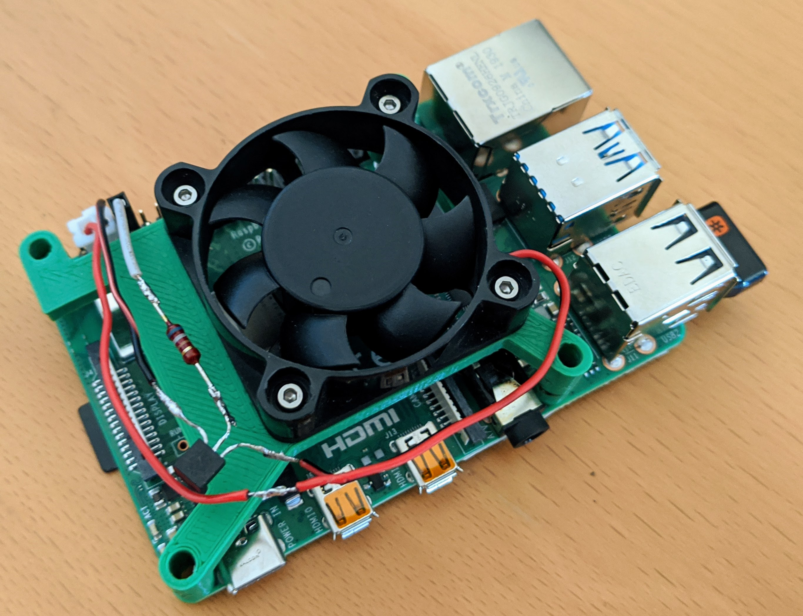

# Dynamic fan control for Raspberry PI

Dynamically adapt the fan speed accroding to the current temperature.

## setup

Just run
```python
python fan_control.py
```

You might want to add this as a cron (`contab -e`) to run automatically on boot.

### Raspberry PI 4 wireing



### Stresstest

Stresstest using [stressberry](https://github.com/nschloe/stressberry) with the case being closed and the fan only start running above 60°C.


## Inspired by 
- https://howchoo.com/g/ote2mjkzzta/control-raspberry-pi-fan-temperature-python
- https://www.hackster.io/104931/smart-raspberry-pi-cpu-fan-2fa422